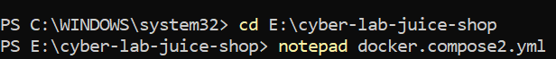
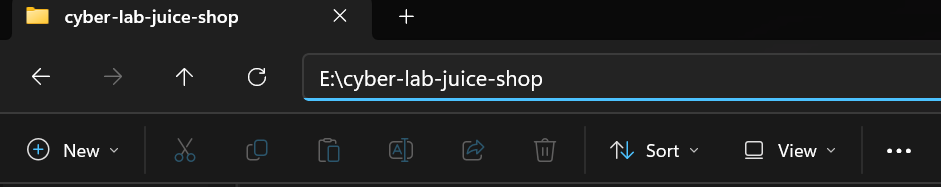
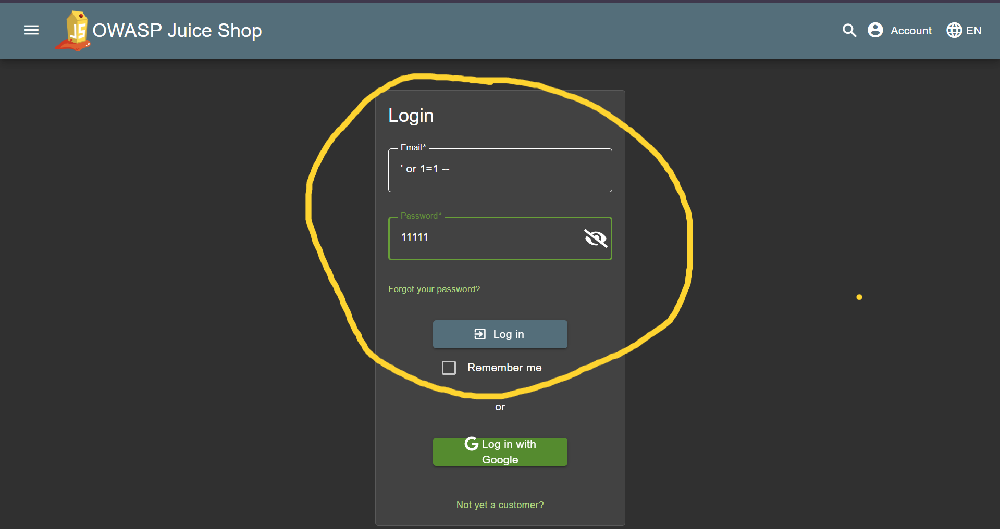
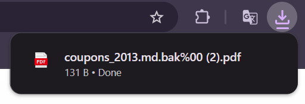

# OWASP Juice Shop - Security Exploration Lab
Proyek ini berisi dokumentasi setup dan vulnerability pada aplikasinya

## Prerequisites
- Docker Engine / Docker Desktop
- Docker Compose

## Setup
1. Jika kalian belum memiliki app nya, download terlebih dahulu di https://www.docker.com/products/docker-desktop/
2. Setelah selesai, buka docker dan cek di bagian pojok bawah kanan bagian Show Hidden Icons. Pastikan ada tulisan **Docker Desktop Running** sudah muncul. Jika sudah muncul, close saja app dockernya.


##

3. Buat folder kosong di File Manager laptop, terserah di penyimpanan manapun. Kalau aku beri nama **cyber-lab-juice-shop**.


##

4. Cari search windows, lalu ketik CMD/PowerShell. Kalau aku pribadi pilih PowerShell dan pencet **Run as Administrator**.
5. Setelah terminal terbuka, kalian ketik sesuai gambar di bawah ini:


**INGAT**: Perintah 'cd' artinya berpindah folder. Jika kalian berada di penyimpanan yang berbeda, kalian bisa menyesuaikan nama penyimpanannya. Kalau di kasusku, aku membuat folder kosong di Volume E. Jadi aku memberikan perintah sesuai gambar diatas. Untuk nama pathnya, bisa dilihat contoh di bawah ini:
##

##

6. Kembali ke perintah Notepad, setelah kalian enter, akan muncul perintah create file dengan pilihan yes or no. Kalian klik yes dan notepad sudah muncul. Kalian isi dengan tulisan ini:
```bash
services:
  juice-shop:
    image: bkimminich/juice-shop
    ports:
    - "3000:3000"
```
Atau kalian bisa menyalin isi file yang sudah kubuat diatas **docker-compose.yml**.
Setelah selesai tekan ctrl+s dan close.

7. Buka kembali terminal sebelumnya dan jangan di close ya, supaya kita bisa memberi perintah dengan benar. Ketik perintah di bawah ini:
```bash
docker-compose up -d
```
Setelah di enter, akan muncul command **running**, itu menandakan bahwa web **Juice Shop** siap dijalankan.

8. Akses Aplikasi Melalui Web http://localhost:3000

##
##

### TEMUAN VULNERABILITY
#### **A. SQL Injection (Authentication Bypass)**
* **Vulnerability:** SQL Injection pada form login.
* **Payload:** `' or 1=1 --`
* **Hasil:** Berhasil masuk ke akun administrator tanpa mengetahui kata sandi yang asli.

#### **B. Cross-Site Scripting (Reflected XSS)**
* **Vulnerability:** Kurangnya sanitasi input pada fitur pencarian (search bar)
* **Payload:** ``
* **Hasil:** Script berhasil dieksekusi oleh browser dan memunculkan jendela alert 'Hacked'

#### **C. Sensitive Data Exposure (Broken Anti-Dos & FTP Access)**
* **Vulnerability:** Eksposur direktori `/ftp` dan filter file yang lemah.
* **Payload:** Menggunakan teknik *Poison Null Byte* / *Double Encoding* (`%2500.pdf`) untuk mengunduh file cadangan `.bak`.
* **Hasil:** Berhasil mengunduh file `coupons_2013.md.bak` dan dibuka memakai Notepad. File tersebut berisi daftar kode kupon diskon yang seharusnya bersifat rahasia.

#### **D. Broken Access Control**
* **Vulnerability:** Halaman `/administration` dapat diakses tanpa autentikasi admin yang sah dan dapat dimanipulasi dengan token/session.
* **Payload:** `http/localhost:3000/#/administration`
* **Hasil:** User biasa berhasil mengakses halaman admin.

## EVIDENCE
#### *1. ADMIN LOGIN*

##

#### *2. ADMIN BYPASS*

##

#### *3. XSS ALERT*

##

#### *4. LEAKED COUPONS*



##

#### *5. BROKEN ACCESS CONTROL*

##
